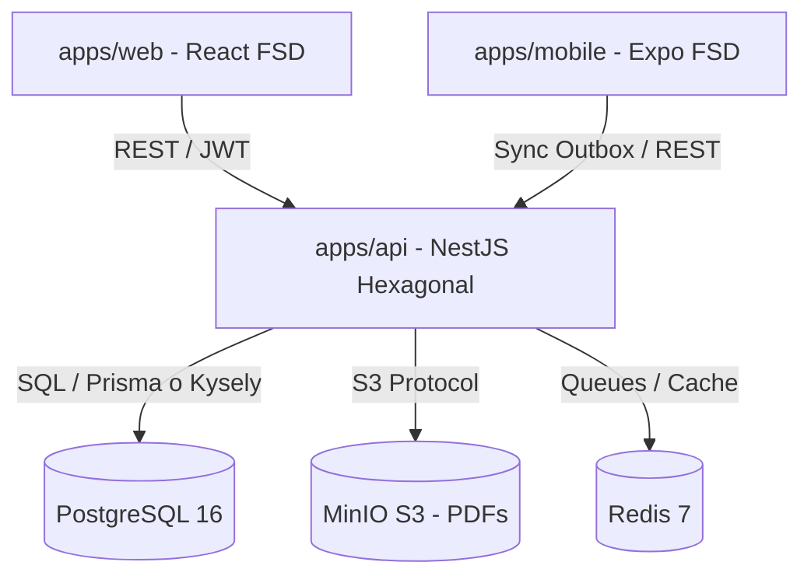

# Technical Design: Fase 1 — Mantenimiento y Operaciones

## Architecture Overview
La arquitectura implementa el patrón Hexagonal (Ports & Adapters) con Screaming Architecture en NestJS (`apps/api`), con PostgreSQL 16 como base de datos transaccional, Redis para control de concurrencia y MinIO como repositorio S3 para fichas técnicas y hojas de seguridad (MSDS).

## Relational Schema (PostgreSQL)

### 1. Tablas Maestras de Mantenimiento
- **`clientes`**:
  - `id` UUID PRIMARY KEY DEFAULT gen_random_uuid()
  - `razon_social` VARCHAR(200) NOT NULL
  - `ruc` VARCHAR(11) NOT NULL UNIQUE
  - `codigo_corto` VARCHAR(10) NOT NULL UNIQUE
  - `direccion_fiscal` TEXT NOT NULL
  - `giro_negocio` VARCHAR(100) NOT NULL
  - `contacto_nombre` VARCHAR(150) NOT NULL
  - `contacto_cargo` VARCHAR(100) NOT NULL
  - `contacto_telefono` VARCHAR(50) NOT NULL
  - `contacto_correo` VARCHAR(150) NOT NULL
  - `estado` VARCHAR(20) NOT NULL DEFAULT 'ACTIVO' -- ACTIVO, INACTIVO
  - `campos_extra` JSONB DEFAULT '{}'
  - `created_at` TIMESTAMPTZ NOT NULL DEFAULT NOW()
  - `updated_at` TIMESTAMPTZ NOT NULL DEFAULT NOW()

- **`proyectos`** (Sedes):
  - `id` UUID PRIMARY KEY DEFAULT gen_random_uuid()
  - `cliente_id` UUID NOT NULL REFERENCES clientes(id) ON DELETE RESTRICT
  - `nombre` VARCHAR(50) NOT NULL -- Ej: PLANTA_SUR, ALMACEN_1
  - `direccion_sede` TEXT NOT NULL
  - `distrito` VARCHAR(50) NOT NULL
  - `provincia` VARCHAR(50) NOT NULL
  - `departamento` VARCHAR(50) NOT NULL
  - `contacto_nombre` VARCHAR(150) NOT NULL
  - `contacto_cargo` VARCHAR(100) NOT NULL
  - `contacto_telefono` VARCHAR(50) NOT NULL
  - `estado` VARCHAR(20) NOT NULL DEFAULT 'ACTIVO'
  - `observaciones` TEXT
  - `created_at` TIMESTAMPTZ NOT NULL DEFAULT NOW()
  - `updated_at` TIMESTAMPTZ NOT NULL DEFAULT NOW()
  - UNIQUE(`cliente_id`, `nombre`)

- **`servicios_contratados`**:
  - `id` UUID PRIMARY KEY DEFAULT gen_random_uuid()
  - `proyecto_id` UUID NOT NULL REFERENCES proyectos(id) ON DELETE RESTRICT
  - `tipo_servicio` VARCHAR(10) NOT NULL -- DSF, DSS, DRT, LRA, LTG, LTS, LAM
  - `frecuencia` VARCHAR(20) NOT NULL -- DIARIA, MENSUAL, TRIMESTRAL, etc.
  - `area_total_m2` NUMERIC(10,2) NOT NULL CHECK (area_total_m2 > 0)
  - `area_tratar_m2` NUMERIC(10,2) NOT NULL CHECK (area_tratar_m2 > 0 AND area_tratar_m2 <= area_total_m2)
  - `requiere_certificado` BOOLEAN NOT NULL DEFAULT FALSE
  - `vigencia_dias` INT
  - `estado` VARCHAR(20) NOT NULL DEFAULT 'ACTIVO'
  - `created_at` TIMESTAMPTZ NOT NULL DEFAULT NOW()
  - `updated_at` TIMESTAMPTZ NOT NULL DEFAULT NOW()

- **`insumos`**:
  - `id` UUID PRIMARY KEY DEFAULT gen_random_uuid()
  - `nombre_comercial` VARCHAR(150) NOT NULL
  - `principio_activo` VARCHAR(150) NOT NULL
  - `presentacion` VARCHAR(50) NOT NULL -- LIQUIDO, POLVO, BLOQUE, etc.
  - `unidad_medida` VARCHAR(20) NOT NULL -- ML, L, G, KG, etc.
  - `registro_digesa` VARCHAR(100) NOT NULL
  - `concentracion` VARCHAR(100) NOT NULL
  - `dosis_estandar` VARCHAR(100) NOT NULL
  - `ficha_tecnica_key` TEXT NOT NULL -- Clave en MinIO
  - `hoja_msds_key` TEXT NOT NULL -- Clave en MinIO
  - `resolucion_key` TEXT -- Clave en MinIO opcional
  - `proveedor` VARCHAR(150)
  - `estado` VARCHAR(20) NOT NULL DEFAULT 'ACTIVO'
  - `created_at` TIMESTAMPTZ NOT NULL DEFAULT NOW()
  - `updated_at` TIMESTAMPTZ NOT NULL DEFAULT NOW()

- **`equipos`**:
  - `id` UUID PRIMARY KEY DEFAULT gen_random_uuid()
  - `codigo_interno` VARCHAR(50) NOT NULL UNIQUE -- EQ-NEB-01
  - `nombre` VARCHAR(150) NOT NULL
  - `tipo` VARCHAR(50) NOT NULL -- FUMIGACION, NEBULIZACION, etc.
  - `marca_modelo` VARCHAR(150)
  - `estado_operativo` VARCHAR(30) NOT NULL DEFAULT 'OPERATIVO' -- OPERATIVO, MANTENIMIENTO, FUERA_SERVICIO
  - `fecha_adquisicion` DATE
  - `ultimo_mantenimiento` DATE
  - `proximo_mantenimiento` DATE
  - `created_at` TIMESTAMPTZ NOT NULL DEFAULT NOW()
  - `updated_at` TIMESTAMPTZ NOT NULL DEFAULT NOW()

- **`personal`**:
  - `id` UUID PRIMARY KEY DEFAULT gen_random_uuid()
  - `dni` VARCHAR(8) NOT NULL UNIQUE
  - `nombres` VARCHAR(100) NOT NULL
  - `apellidos` VARCHAR(100) NOT NULL
  - `cargo` VARCHAR(50) NOT NULL -- SUPERVISOR, TECNICO_OPERADOR
  - `telefono` VARCHAR(50) NOT NULL
  - `usuario` VARCHAR(50) UNIQUE
  - `estado` VARCHAR(20) NOT NULL DEFAULT 'ACTIVO'
  - `created_at` TIMESTAMPTZ NOT NULL DEFAULT NOW()
  - `updated_at` TIMESTAMPTZ NOT NULL DEFAULT NOW()

### 2. Tablas de Operaciones e Inmutabilidad (Sección 13)
- **`inspecciones`**:
  - `id` UUID PRIMARY KEY DEFAULT gen_random_uuid()
  - `servicio_id` UUID NOT NULL REFERENCES servicios_contratados(id)
  - `codigo_inspeccion` VARCHAR(50) NOT NULL UNIQUE -- Ej: GAFER-2026-KALLPA-001
  - `estado` VARCHAR(30) NOT NULL DEFAULT 'BORRADOR' -- BORRADOR, CERRADO, ENVIADO_A_REVISION, OBSERVADO, APROBADO
  - `version_sync` INT NOT NULL DEFAULT 1
  - `fecha_ejecucion` DATE NOT NULL
  - `hora_inicio` TIME
  - `hora_fin` TIME
  - `tecnicos_participantes` JSONB NOT NULL DEFAULT '[]'
  - `snapshot_catalogos` JSONB NOT NULL -- Snapshot inmutable de insumos, equipos y personal usados
  - `created_at` TIMESTAMPTZ NOT NULL DEFAULT NOW()
  - `updated_at` TIMESTAMPTZ NOT NULL DEFAULT NOW()

- **`inspecciones_auditoria`**:
  - `id` UUID PRIMARY KEY DEFAULT gen_random_uuid()
  - `inspeccion_id` UUID NOT NULL REFERENCES inspecciones(id) ON DELETE CASCADE
  - `actor_id` UUID NOT NULL REFERENCES personal(id)
  - `accion` VARCHAR(50) NOT NULL -- CREACION, CARGA_ESTACIONES, CIERRE, OBSERVACION, APROBACION
  - `payload_anterior` JSONB
  - `payload_nuevo` JSONB
  - `server_received_at` TIMESTAMPTZ NOT NULL DEFAULT NOW()

## Patrón de Inmutabilidad Snapshot JSON
Cuando una inspección pasa a estado `CERRADO` o se registra consumo de insumos:
1. El backend consulta los datos vigentes del insumo (`nombre_comercial`, `registro_digesa`, `lote`, etc.).
2. Clona los datos en una estructura JSONB inmutable dentro de `inspecciones.snapshot_catalogos`.
3. Ninguna consulta de reportes históricos hace `JOIN` sobre la tabla `insumos` para obtener las descripciones que saldrán en el PDF oficial. Se lee directamente del snapshot.
